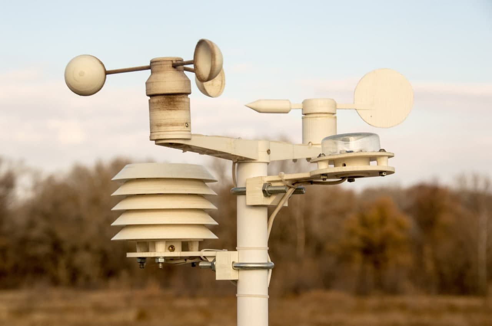
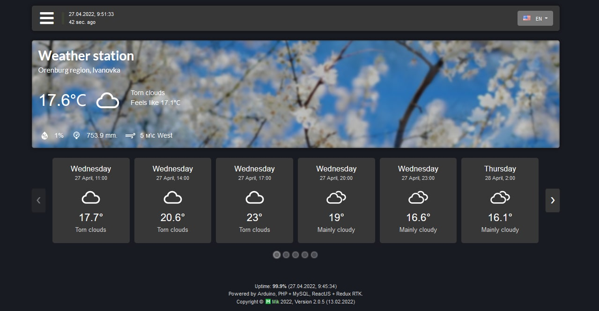
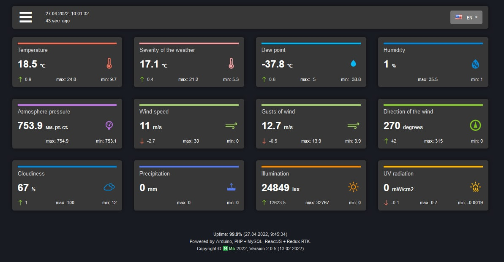
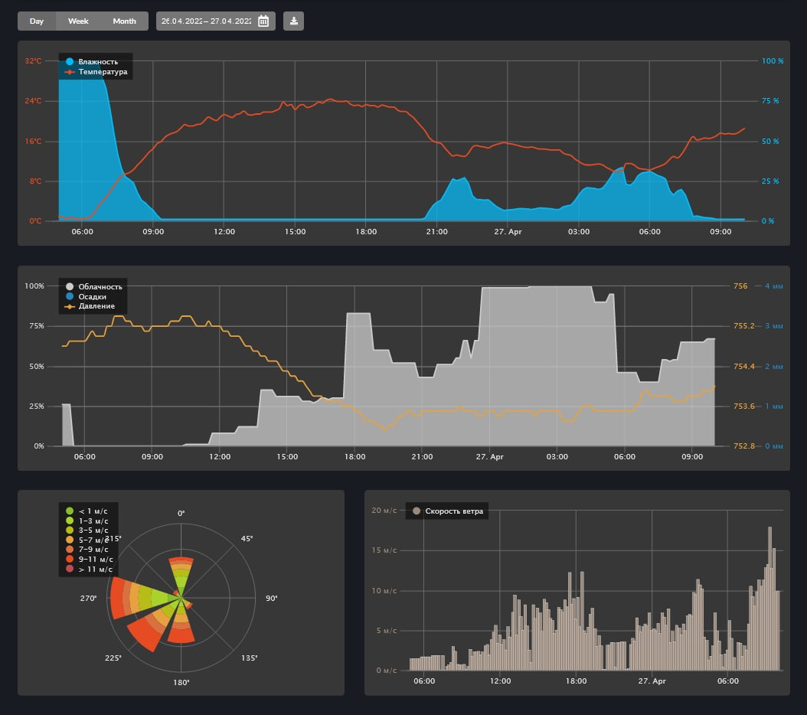
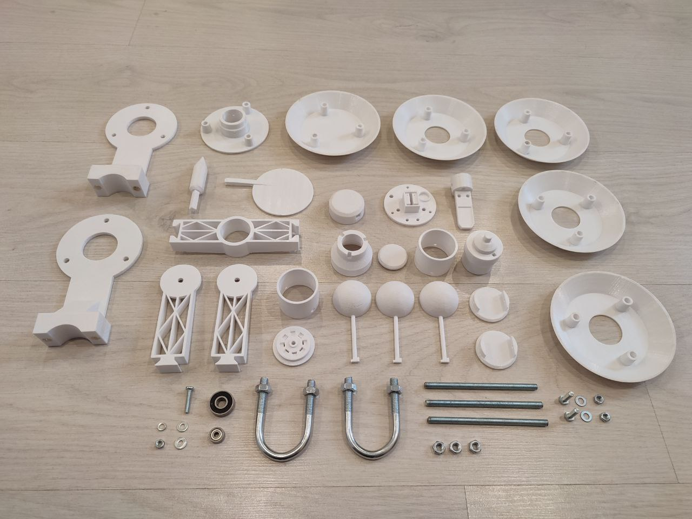

Arduino Weather Station
===============

This project is designed to teach the basic skills and understanding of working with microcontrollers ATmega (Arduino). The project is a working model of an automated weather station, consisting of two the Component: transmitter and receiver. The controller transmits data to a remote web server, and to indicate the current readings uses character.

🌐 https://meteo.miksoft.pro

The weather station is capable of transmitting the following data on the state of the environment: 
- temperature
- humidity
- dewpoint
- illumination
- UV intensity
- wind speed
- wind direction
- atmosphere pressure

To display data, a web interface was built in ReactJS, which requests data from a remote server. The interface displays not only current indicators, but also archived data, allows you to make a selection for a certain period. 

The statistics page, which reveals the history of weather changes for the selected observation period.

----------------------

### Project structure

This project consists of 4 main sections: 

1. [ **arduino** ] Firmware for Arduino microcontroller (AVR), weather station control unit.
2. [ **models** ] 3D model of weather station for printing.
3. [ **backend** ] Backend server. 
4. [ **frontend** ] Interface for displaying current and statistical data from the weather station. Written in ReactJS + Redux (use Node and NPM). To debug an application on a local server, you must first install the necessary dependencies:
  * `npm install` Installing dependencies.
  * `npm update` Update all dependencies.
  * `npm start` Launches a local webserver for debugging the application.
  * `npm run build` Compiles applications for deployment.

----------------------

### Necessary electronic components 

- Arduino Leonardo ETH \ Nano + NC28J60 Ethernet
- BMP085 \ BMP280
- DHT22
- BH1750
- PCF8574 (port expander)
- ML 8511
- SS41F (digital hall sensor) - 9pcs
- 608ZZ (bearing)
- 3x2 mm neodymium magnet - 2pcs

The project uses self-made developments, such as the airflow meter (angular velocity sensor based), voltmeter, light meter, as well as the switching board for Arduino PRO mini and transistor switches.

----------------------

### Models for 3D printing

- Wind direction
- Sensors holder
- Radiation shield
- DHT22 + BMP085 mount
- Anemometr
