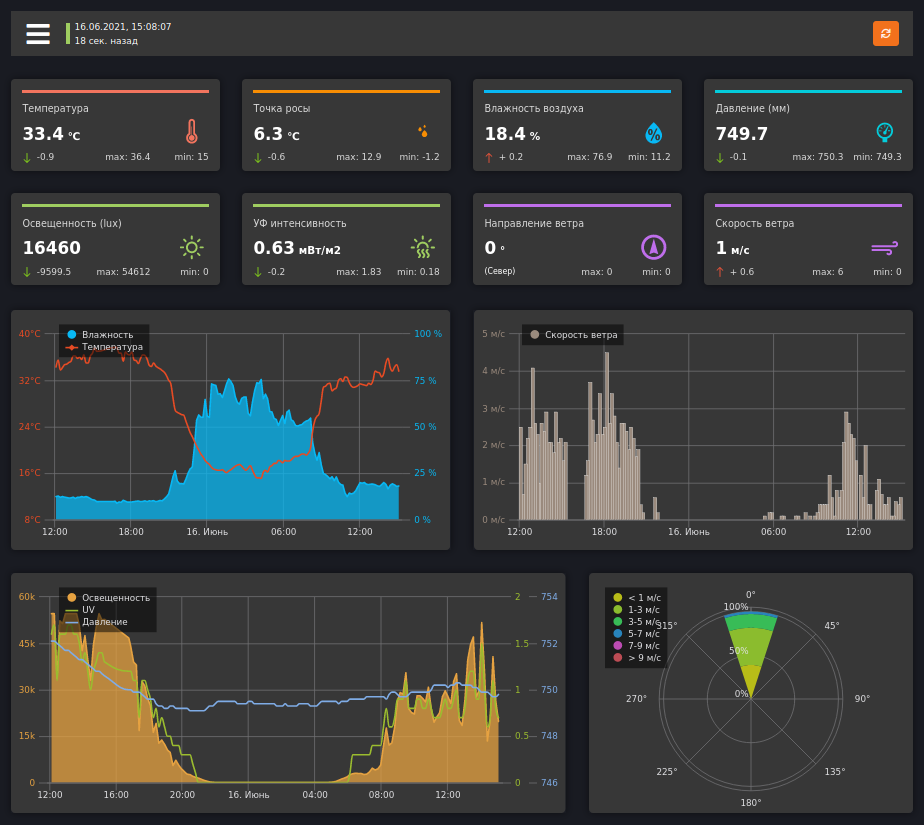

Arduino Weather Station
===============
This project is designed to teach the basic skills and understanding of working with microcontrollers ATmega (Arduino). The project is a working model of an automated weather station, consisting of two the Component: transmitter and receiver. The controller transmits data to a remote web server, and to indicate the current readings uses character.

[ [DEMO](https://meteo.miksoft.pro/) ]

The weather station is capable of transmitting the following data on the state of the environment: 
- temperature
- humidity
- illumination
- UV intensity
- wind speed
- wind direction
- atmosphere pressure

To display data, a web interface was built in ReactJS, which requests data from a remote server. The interface displays not only current indicators, but also archived data, allows you to make a selection for a certain period. 

----------------------

### Components

- Arduino Leonardo ETH \ Nano + NC28J60 Ethernet
- BMP085 \ BMP280
- DHT22
- BH1750
- PCF8574 (port expander)
- ML 8511
- SS41F (digital hall sensor) - 9pcs
- 608ZZ (bearing)
- 3x2 mm neodymium magnet - 2pcs

The project uses self-made developments, such as the airflow meter (angular velocity sensor based), voltmeter, light meter, as well as the switching board for Arduino PRO mini and transistor switches.

----------------------

### Models for 3D printing

- Wind direction
- Sensors holder
- Radiation shield
- DHT22 + BMP085 mount
- Anemometr