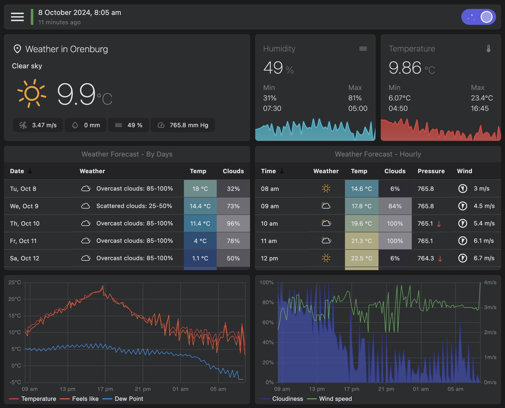

<a id="top"></a>

<!-- PROJECT TITLE -->
Arduino Weather Station is an automated weather monitoring project built on Arduino for collecting environmental data, featuring an API (PHP + MySQL + CodeIgniter) and a web interface (Next.js + Redux RTK) for real-time and historical weather data analysis. Please give the project a star :)

<div align="center">
  

<h3>Arduino Weather Station</h3>
<a href="https://github.com/miksrv/arduino-weather-station"><strong>Explore the docs »</strong></a>
<br /><br />
<a href="https://meteo.miksoft.pro">Demo</a>
·
<a href="https://github.com/miksrv/arduino-weather-station/issues/new?assignees=miksrv&labels=bug&projects=&template=1-bug.yml&title=%5BBug%5D%3A+">Report Bug</a>
·
<a href="https://github.com/miksrv/arduino-weather-station/issues/new?assignees=miksrv&labels=enhancement&template=2-feature-request.yml&title=%5BFeature%5D%3A+">Request Feature</a>
·
<a href="#contact">Contact</a>
</div>

<br />

<!-- PROJECT BADGES -->
<div align="center">

[![Contributors][contributors-badge]][contributors-url]
[![Forks][forks-badge]][forks-url]
[![Stargazers][stars-badge]][stars-url]
[![Issues][issues-badge]][issues-url]
[![MIT License][license-badge]][license-url]

</div>

---

<!-- TABLE OF CONTENTS -->
### Table of Contents

- [About of Project](#about-of-project)
    - [Key Features](#key-features)
    - [Measured Parameters](#measured-parameters)
    - [Built With](#built-with)
- [Installation](#installation)
- [Usage](#usage)
- [Screenshots and Demos](#screenshots-and-demos)
- [Contributing](#contributing)
- [License](#license)
- [Acknowledgments](#acknowledgments)
- [Contact](#contact)

<!-- ABOUT OF PROJECT -->
## About of Project

The Arduino Weather Station is an advanced, automated weather monitoring system designed to collect, process, and display real-time environmental data. The weather station is built using an Arduino microcontroller to handle sensor input and transmit data to a backend server. This data is then made available through an API built on PHP, MySQL, and CodeIgniter, with a frontend developed using Next.js and Redux RTK.


### Key Features:
- **Real-time Data Collection:** The weather station continuously monitors various atmospheric parameters using multiple sensors.
- **Historical Data Storage:** Weather data is stored in a database, allowing users to view and analyze past conditions over selected periods.
- **Remote Access:** A web-based interface allows users to access weather information from anywhere, displaying current readings and historical trends.
- **Data Visualization:** Users can view live graphs of parameters such as temperature, humidity, pressure, and more, along with detailed statistics for selected time frames.
- **API Integration:** The backend provides an API for developers to access weather data for integration into external applications.


### Measured Parameters:
- Temperature
- Feels like temperature
- Humidity
- Dew point
- UV intensity
- Solar energy
- Solar radiation
- Wind speed and direction
- Atmospheric pressure
- Precipitation levels
- Cloud cover

The system is highly customizable, and additional sensors can be integrated to expand its functionality. This project demonstrates how microcontrollers, web development, and real-time data processing can be combined to create a fully functional, real-world application.

<p align="right">
  (<a href="#top">Back to top</a>)
</p>

### Built With

The Arduino Weather Station project leverages a wide range of technologies across various layers of the system:

- [![C++][c++-badge]][c++-url] Programming language used for the Arduino firmware.
- [![PHP][php-badge]][php-url] Server-side scripting language for the backend API.
- [![MySQL][mysql-badge]][mysql-url] Database system for storing weather data.
- [![NextJS][nextjs-badge]][nextjs-url] React-based frontend framework for building the user interface.
- [![Redux][redux-badge]][redux-url] State management for the frontend, providing predictable and centralized state.
- [![JS][js-badge]][js-url] Core languages used in frontend development.
- [![NodeJS][nodejs-badge]][nodejs-url] JavaScript runtime used for frontend development and package management.
- [![Sass][sass-badge]][sass-url] Styling the user interface.
- [![GitHub Actions][githubactions-badge]][githubactions-url] Continuous integration and deployment pipeline for automating tests and deployment processes.
- [![SonarCloud][sonarcloud-badge]][sonarcloud-url] Code quality and security analysis.

This project also includes custom-designed components for measuring airflow, voltage, and light, making use of 3D printing for hardware integration.

<p align="right">
  (<a href="#top">Back to top</a>)
</p>

<!-- INSTALLATION -->
## Installation

Follow these steps to install and run the Arduino Weather Station project on your local machine.

### Prerequisites

Make sure you have the following installed on your system:
- **Node.js** (v20 or higher)
- **NPM** or **Yarn** (for frontend dependencies)
- **PHP** (v8.0 or higher)
- **Composer** (for backend dependencies)
- **MySQL** (or any compatible database)
- **Arduino IDE** (for programming the Arduino microcontroller)

### 1. Clone the repository

```bash
git clone https://github.com/miksrv/arduino-weather-station.git
cd arduino-weather-station
```

### 2. Backend Setup (PHP + CodeIgniter)

1. Navigate to the `server` folder:

   ```bash
   cd backend
   ```

2. Install PHP dependencies using Composer:

   ```bash
   composer install
   ```

3. Create a `.env` file and configure your environment variables, such as database connection settings:

   ```bash
   cp .env.example .env
   ```

4. Migrate the database:

   ```bash
   php spark migrate
   ```

5. Start the backend server (built-in PHP server or any web server of your choice):

   ```bash
   php spark migrate
   ```

### 3. Frontend Setup (Next.js + Redux)

1. Navigate to the `client` folder:

   ```bash
   cd ../client
   ```

2. Install frontend dependencies:

   ```bash
   npm install
   ```

3. Run the frontend in development mode:

   ```bash
   npm run dev
   ```

4. To build the project for production:

   ```bash
   npm run build
   ```

5. Optionally, start the production build:

   ```bash
   npm start
   ```

### 4. Arduino Setup

1. Open the Arduino sketch from the `firmware` folder in the Arduino IDE.
2. Connect your Arduino microcontroller and upload the sketch.
3. Make sure the Arduino is correctly wired with the sensors.

### 5. Accessing the Application

Once the backend and frontend servers are running, access the weather station UI by visiting:

```
http://localhost:3000
```

You can now monitor real-time and historical weather data from the Arduino Weather Station!

<div align="center">

    

</div>

<p align="right">
  (<a href="#top">Back to top</a>)
</p>

<!-- USAGE -->
## Usage

After successfully installing and setting up the Arduino Weather Station project, follow these steps to start using the application and monitor weather data.

### 1. Access the Web Interface

- Open your browser and navigate to the frontend running at `http://localhost:3000` (or the production URL if deployed).
- You will see a dashboard displaying current weather conditions as well as the option to view historical data.

### 2. Real-Time Weather Data

- The dashboard updates weather data in real-time, pulling data from the Arduino sensors connected to your weather station.
- Key metrics displayed include:
    - **Temperature**
    - **Humidity**
    - **Dew Point**
    - **UV Index**
    - **Wind Speed & Direction**
    - **Pressure**
    - **Precipitation**
    - **Solar Radiation**

### 3. Historical Data

- Navigate to the **History** or **Statistics** page from the main menu.
- Choose a date range to view weather trends and archived data, including charts for various metrics like temperature, wind, and humidity.

<div align="center">

    

</div>

### 4. Customize Data Display

- You can customize the data display to show or hide specific sensors on the dashboard.
- For example, toggle between temperature readings, feels-like temperature, and dew point, or switch between solar energy and solar radiation.

### 5. Arduino Sensor Calibration

- For accurate readings, you may need to calibrate some sensors depending on your specific environment. Refer to the Arduino sketch in the `arduino/` folder to adjust the calibration values for sensors such as temperature or pressure.

### 6. Data Export

- Weather data can be exported from the **Statistics** page in various formats (e.g., CSV) to analyze trends further.

### 7. System Maintenance

- The backend server running on PHP + CodeIgniter is responsible for handling incoming data from the Arduino sensors and storing it in a MySQL database. Ensure the backend is running to avoid data loss.
- The frontend is built with Next.js and provides a smooth interface to view, interact with, and analyze weather data.

### 8. Arduino Weather Station Features

- **Real-time Monitoring**: Monitor real-time weather conditions using connected sensors.
- **Historical Data**: Review weather history with customizable date ranges.
- **Graphical Visualizations**: View weather trends and patterns using interactive charts.
- **Sensor Readings**: Monitor multiple environmental factors, such as UV Index, wind speed, and solar radiation.

## Screenshots and Demos

#### 1. **Current Weather Overview**

The **Current** section provides real-time data on the current weather conditions, including temperature, humidity, UV index, and more. Users can quickly view all key environmental metrics at a glance.


#### 2. **Sensors Dashboard**

The **Sensors** section displays a list of all connected weather sensors, including temperature, pressure, wind speed, and solar radiation. This section gives users an in-depth view of each sensor's status and real-time readings.


#### 3. **Weather History and Trends**

The **History** section allows users to explore weather data over a specified time period. Interactive charts provide insights into trends for various weather metrics like temperature, wind speed, and humidity.


#### Live Demo

Explore the fully functioning weather station web application at:  
🌐 [Live Demo](https://meteo.miksoft.pro/en)

<p align="right">
  (<a href="#top">Back to top</a>)
</p>

<!-- CONTRIBUTING -->
## Contributing

Contributions are what make the open-source community an incredible environment for learning, inspiration, and innovation. Your contributions are highly valued and greatly appreciated, whether it’s reporting bugs, suggesting improvements, or creating new features.

**To contribute:**

1. Fork the project by clicking the "Fork" button at the top of this page.
2. Clone your fork locally:
   ```bash
   git clone https://github.com/miksrv/arduino-weather-station.git
   ```
3. Create a new feature branch:
   ```bash
   git checkout -b feature/AmazingFeature
   ```
4. Make your changes, then commit them:
   ```bash
   git commit -m "Add AmazingFeature"
   ```
5. Push your changes to your forked repository:
   ```bash
   git push origin feature/AmazingFeature
   ```
6. Open a pull request from your feature branch to the main repository.

We encourage contributions of all kinds, whether big or small. Your efforts help improve the project for everyone!

## License

<!-- LICENSE -->
Distributed under the MIT License. See [LICENSE](LICENSE) for more information.

<p align="right">
  (<a href="#top">Back to top</a>)
</p>

<!-- ACKNOWLEDGEMENTS -->
## Acknowledgments

This section is dedicated to recognizing the resources and individuals that have been invaluable to this project. I’d like to highlight a few key tools and contributions that made a significant impact on its development. Feel free to explore them as they may be useful for your own projects!

1. [CodeIgniter](https://codeigniter.com/user_guide/helpers/date_helper.html)

<p align="right">
  (<a href="#top">Back to top</a>)
</p>

## Contact

Misha - [miksoft.pro](https://miksoft.pro)

<p align="right">
  (<a href="#top">Back to top</a>)
</p>

<!-- MARKDOWN VARIABLES (LINKS, IMAGES) -->
[contributors-badge]: https://img.shields.io/github/contributors/miksrv/arduino-weather-station.svg?style=for-the-badge
[contributors-url]: https://github.com/miksrv/arduino-weather-station/graphs/contributors
[forks-badge]: https://img.shields.io/github/forks/miksrv/arduino-weather-station.svg?style=for-the-badge
[forks-url]: https://github.com/miksrv/arduino-weather-station/network/members
[stars-badge]: https://img.shields.io/github/stars/miksrv/arduino-weather-station.svg?style=for-the-badge
[stars-url]: https://github.com/miksrv/arduino-weather-station/stargazers
[issues-badge]: https://img.shields.io/github/issues/miksrv/arduino-weather-station.svg?style=for-the-badge
[issues-url]: https://github.com/miksrv/arduino-weather-station/issues
[license-badge]: https://img.shields.io/github/license/miksrv/arduino-weather-station.svg?style=for-the-badge
[license-url]: https://github.com/miksrv/arduino-weather-station/blob/master/LICENSE.txt

<!-- Other ready-made icons can be seen for example here: https://github.com/inttter/md-badges -->
[js-badge]: https://img.shields.io/badge/JavaScript-F7DF1E?logo=javascript&logoColor=000
[js-url]: https://www.javascript.com/
[nextjs-badge]: https://img.shields.io/badge/Next.js-black?logo=next.js&logoColor=white
[nextjs-url]: https://nextjs.org/
[nodejs-badge]: https://img.shields.io/badge/Node.js-6DA55F?logo=node.js&logoColor=white
[nodejs-url]: https://nodejs.org/
[redux-badge]: https://img.shields.io/badge/Redux-764ABC?logo=redux&logoColor=fff
[redux-url]: https://redux.js.org/
[sass-badge]: https://img.shields.io/badge/Sass-C69?logo=sass&logoColor=fff
[sass-url]: https://sass-lang.com/
[c++-badge]: https://img.shields.io/badge/C++-%2300599C.svg?logo=c%2B%2B&logoColor=white
[c++-url]: https://cplusplus.com/
[php-badge]: https://img.shields.io/badge/php-%23777BB4.svg?&logo=php&logoColor=white
[php-url]: https://www.php.net/
[mysql-badge]: https://img.shields.io/badge/MySQL-4479A1?logo=mysql&logoColor=fff
[mysql-url]: https://www.mysql.com/
[sonarcloud-badge]: https://img.shields.io/badge/SonarCloud-F3702A?logo=sonarcloud&logoColor=fff
[sonarcloud-url]: https://sonarcloud.io/
[githubactions-badge]: https://img.shields.io/badge/GitHub_Actions-2088FF?logo=github-actions&logoColor=white
[githubactions-url]: https://docs.github.com/en/actions
