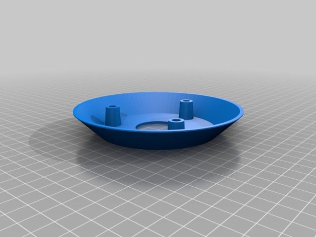
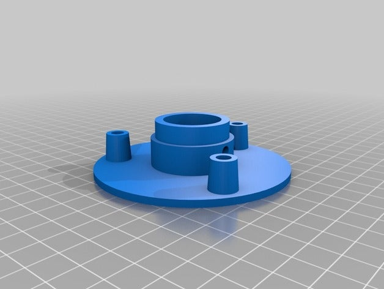
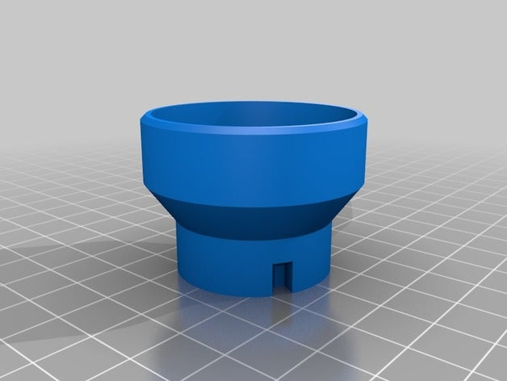
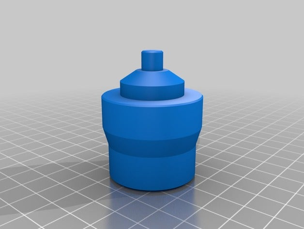
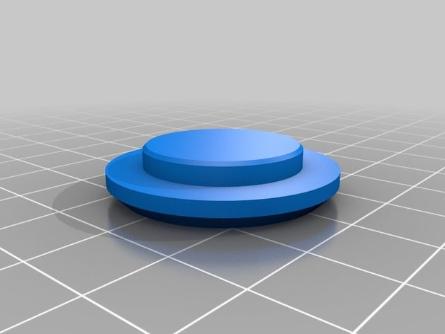
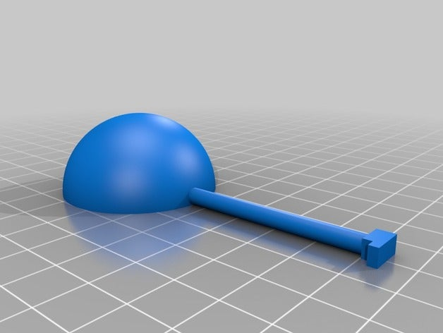
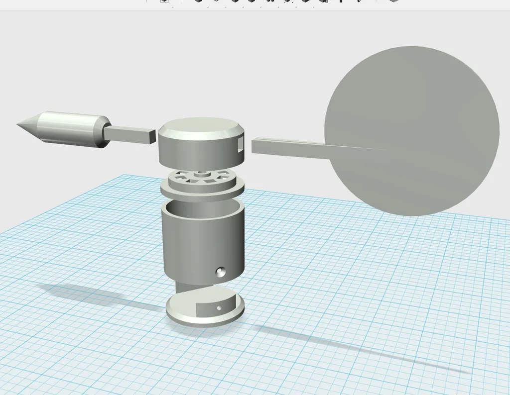

# **3D Models for the DIY Weather Station**

This directory contains all 3D-printable components used in the DIY Arduino/ESP32 Weather Station.  
Each model is designed to be simple, robust, and suitable for budget-level 3D printers.

All models were originally printed on a very basic **Anet A6** (one of the simplest consumer-grade printers) using **ABS filament**.  
Despite the low-end hardware, the enclosure has survived **4+ years outdoors** without deformation or degradation.

For best durability, it is recommended to print using:

- **PETG** (preferred for UV resistance and outdoor conditions)
- or **ABS** (tested and proven to work long-term)

Print the parts in **white filament only** - this significantly improves reflectivity, reduces solar heating, and minimizes UV exposure.

---

# **Contents**

1. [Radiation Shield](#radiation-shield)
2. [DHT22 + BMP085 Mount](#dht22--bmp085-mount)
3. [Anemometer](#anemometer)
4. [Sensors Holder](#sensors-holder)
5. [Wind Direction Sensor](#wind-direction-sensor)

---

## Radiation Shield
Weather station radiation shield for accurate air temperature and humidity measurement. Designed to protect sensors from direct sunlight, rain, and reflected heat while allowing free airflow. 

This directory also includes adapters for mounting different temperature and humidity sensors.

### **rad_shd.stl** - shield plate
One of the main plate elements of the radiation shield. Forms the layered structure that blocks direct sunlight.

**Quantity:** 4 pcs (minimum required to fit the sensor adapter).

### **rad_shd_base.stl** - bottom base
The bottom foundation of the shield assembly. The first layer onto which the plates are stacked.

**Quantity:** 1 pc.

### **rad_shd_top.stl** - top cover
The uppermost element that closes the radiation shield. Protects from precipitation and locks the structure together.

**Quantity:** 1 pc.

### **rad_shd_vert_mount.stl** - vertical mount
Mounting bracket for attaching the radiation shield to a pipe or vertical pole.

**Quantity:** 1 pc.

---

## DHT22 + BMP085 Mount
This is a combined sensor mount designed to hold both the **DHT22** (temperature and humidity) and **BMP085** (barometric pressure) sensors.  
The mount is sized to fit directly inside the **Radiation Shield**, ensuring proper airflow and protection from direct sunlight.

**Quantity:** 1 pc.

---

## **Anemometer**

A rain-resistant, 3D-printed anemometer designed for measuring wind speed using an **A1120 Hall sensor** and two **2×2 mm neodymium magnets**.  

The perimeter of the rotating assembly is **50 cm**, meaning the anemometer completes **2 full rotations at a wind speed of 1 m/s**.

The design requires **no print supports** and uses a standard **608ZZ bearing** for smooth rotation. After installing the Hall sensor, it must be waterproofed (e.g., with epoxy resin or similar).

**Required materials:**
- 1× **608ZZ bearing**
- 2× **Neodymium magnets 2×2 mm**
- 1× **A1120 Hall sensor** (must be bent 90° as shown in the preview)
- Waterproofing compound (epoxy or similar)

#### **anemometr-sep1.stl - Upper rotating hub**

Holds the three blades and rotates around the 608ZZ bearing.  

**Quantity:** 1 pc.

#### **anemometr-sep2.stl - Base mount**
The stationary lower part. Holds the 608ZZ bearing; the rotating hub is mounted on top of it.  

**Quantity:** 1 pc.

#### **anemometr-sep3.stl - Top cover**
Covers the rotating hub after the blades are inserted. Provides protection for the bearing against rain and snow.  

**Quantity:** 1 pc.

#### **anemometr-sep4.stl - Blade**

Aerodynamic blade for the spinning assembly. Three blades are required for stable and accurate rotation.  

**Quantity:** 3 pcs.

---

## Sensors Holder

A simple **sensor holder arm** used to mount both the **anemometer** and **wind direction vane** onto a vertical pole. This assembly provides a stable support structure and keeps both instruments aligned and properly spaced.

**Files to print:**
- **sensors_holder_arm_X2.stl** - 2 pcs
- **sensors_holder_center.stl** - 1 pc

**Quantity summary:** 3 printed parts total.

---

## Wind Direction Sensor

**Weather station wind direction sensor** - a 3D-printed wind vane capable of detecting **16 positions** using **8 magnetic sensors**. This component is part of the 3D-printed weather station project and provides accurate wind direction measurement when paired with a **PCF8574** I²C port expander.

The vane uses a **5×3 mm round magnet** mounted in the rotating part and eight Hall sensors placed around the base to detect the magnet’s position.

### Electronics Required
- **8× Hall sensors** (digital, e.g., A3144 or similar)
- **1× 5×3 mm round neodymium magnet**
- **1× PCF8574 port expander**

---

# **Notes**

- All models are designed for easy printing even on low-cost printers.
- PETG provides the best balance of strength and UV resistance.
- ABS also works well - prototypes have survived **4+ years outdoors** with zero damage.
- Always print in white for thermal stability and UV protection.

